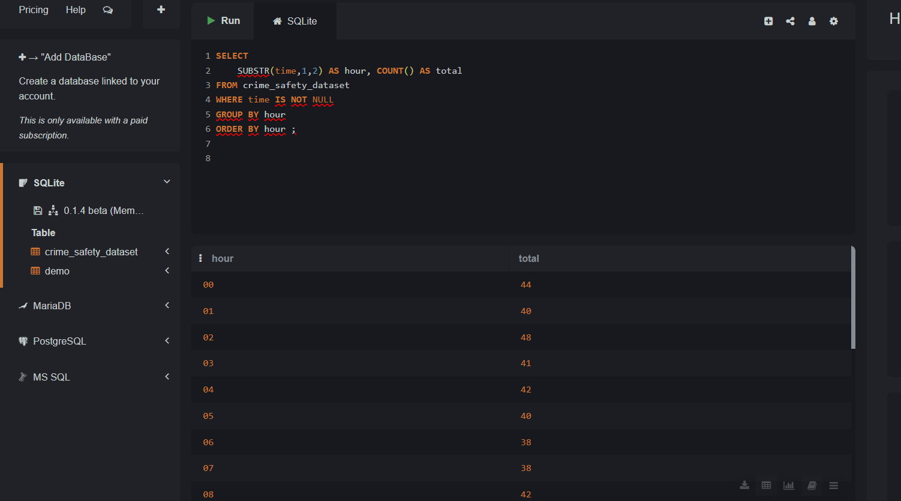

# 🕵️ Crime & Safety Dataset Analysis (SQL Project)

This project explores a dataset of 1,000 real crime reports collected over two years in an urban area.  
Each record contains the crime type, time, location, and victim demographics such as age, gender, and race.

The goal of this analysis is to uncover patterns related to demographics, crime frequency, and locations using SQL.

---

## 🎯 Objectives

- Identify peak hours and dates for crime
- Analyze crimes by victim age, race, and gender
- Compare crime volume by city and crime type
- Highlight crimes involving vulnerable age groups (minors, elderly)

---

## 📁 Files Included

| File | Description |
|------|-------------|
| `crime_safety_dataset.csv` | Raw dataset from Kaggle |
| PNG charts below | Visual summaries of SQL query results |

---

## 📊 Visual Insights

### 📍 Crimes by City

Houston recorded the highest number of crimes in the dataset with a total of 106.


---

### 👶 Crimes Involving Victims Under 18

Assault was the most reported crime involving minors, with **9 victims** under the age of 18.


---

### 🧑🏽 Crimes Against Racial Groups by Type

Among **Asian victims**, robbery was the most common crime, with **32 incidents**.


---

### 🧓 Average Victim Age by Crime Type

**Vandalism** affected the oldest age group, with an average victim age of **56.4 years**.


---

### 🕒 Crimes by Time of Day

Most crimes occurred at **18:00 (6 PM)** with a peak of **54 incidents**, followed by **44 at midnight (00:00)**.



---

## 🧠 Example SQL Query

```sql
SELECT city, victim_gender, crime_type, COUNT(*) AS total
FROM crime_safety_dataset
GROUP BY city, victim_gender, crime_type
ORDER BY city, total DESC;
---

## 📈 Summary of Key Insights

- 🔹 **Houston** had the highest crime volume with **106 total incidents**
- 🔹 **Assault** was the most common crime among minors, with **9 victims under 18**
- 🔹 **Vandalism** targeted older individuals the most (average age **56.4 years**)
- 🔹 **Asian victims** reported **32 cases** of **robbery** — the highest for that group
- 🔹 Crimes peaked at **18:00 (6 PM)** with a secondary peak at **00:00 (midnight)**

These insights were discovered using SQL (SQLite) and visualized using simple charts.  
They can be used to inform targeted crime prevention strategies or future predictive models.

---


## 👤 About the Author

**Mohamed Eswai**  
📍 Granada, Spain  
📧 m.eswai@icloud.com  
🔗 [LinkedIn Profile](https://www.linkedin.com/in/mohamed-eswai-31207b372/)

> Thank you for reviewing this project. Feel free to connect or reach out for collaboration, freelance opportunities, or feedback.


